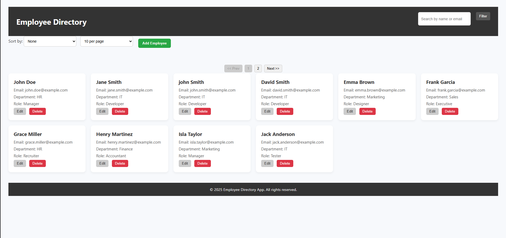
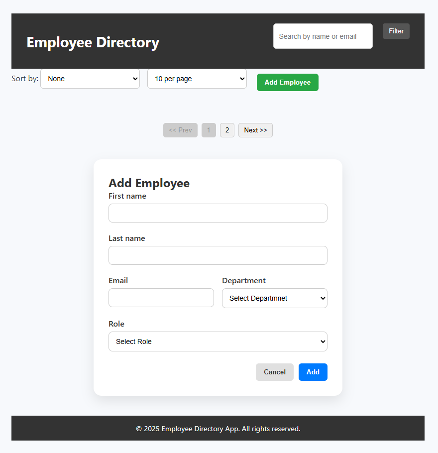
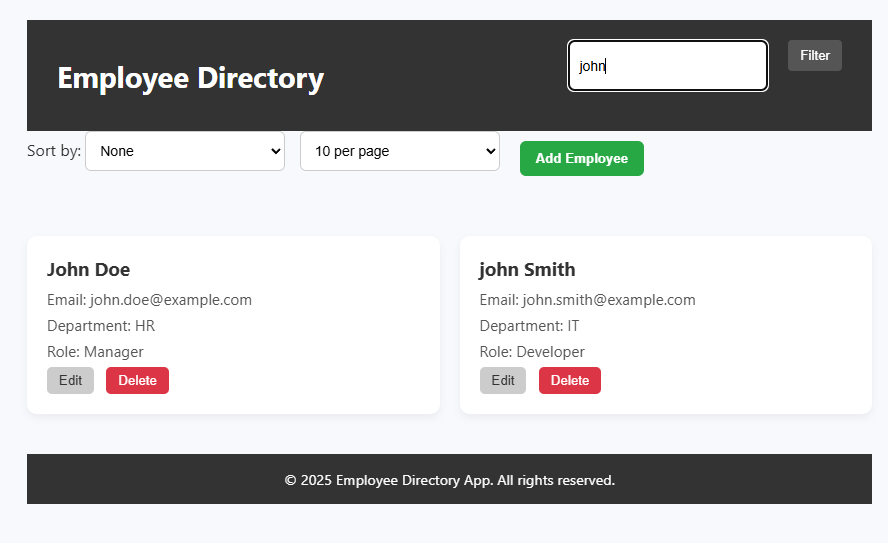
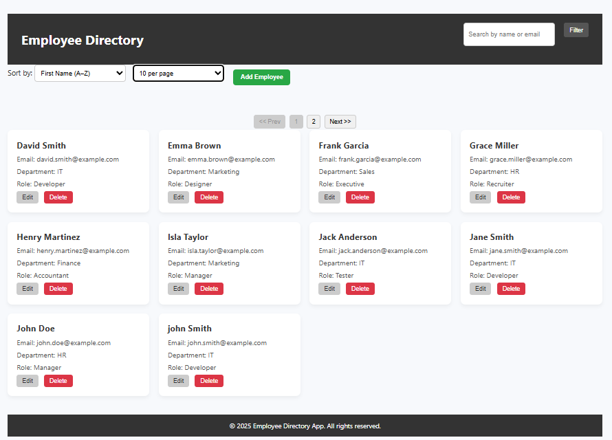
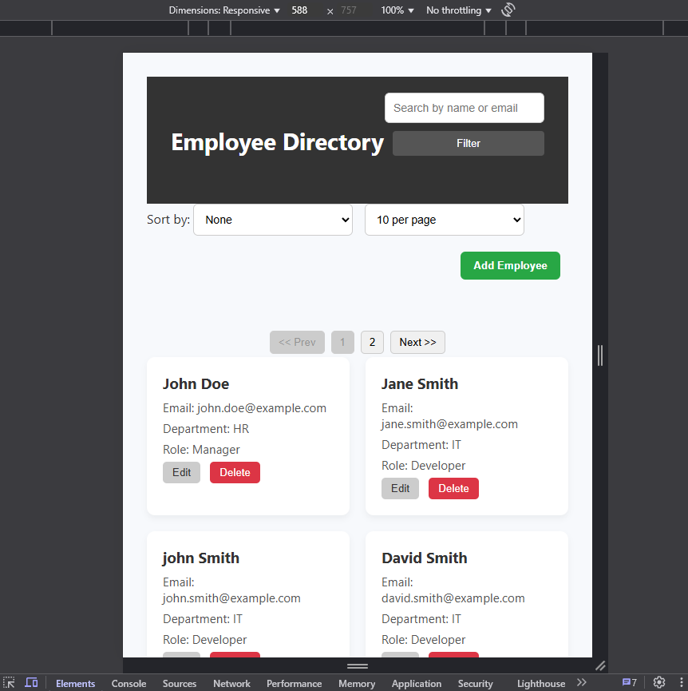

# Employee Directory -  Assignment (AJACKUS)

This project is a responsive, interactive employee directory web interface built with HTML, CSS, and Vanilla JavaScript. It was developed as part of the AJACKUS Frontend Developer Intern assignment.

---

## 📁 Project Structure

employee-directory/
├── src/
│   └── main/
│       └── resources/
│           ├── static/
│           │   ├── css/
│           │   │   └── style.css
│           │   ├── js/
│           │   │   ├── data.js
│           │   │   └── app.js
│           └── templates/
│               └── index.ftlh
├── README.md

---

## 🚀 Features

- ✅ **Responsive Dashboard UI**
- ✅ **Add / Edit / Delete Employees**
- ✅ **Search** by first name, last name, or email
- ✅ **Filter** by:
  - First Name (via input)
  - Department (dropdown)
  - Role (dropdown)
- ✅ **Sorting** by:
  - First Name (A–Z )
  - Department (A–Z )
- ✅ **Pagination** with customizable page size (10 / 25 / 50 / 100)
- ✅ **Form validation** (Required fields, valid email)
- ✅ **Filter Sidebar** (toggle visibility)
- ✅ **Fully modular JS and DOM-driven UI**

---

## 🔧 Setup Instructions

1. Clone the repo
2. Open `index.html` in your browser (no server needed)
3. All data is mock and loaded from `data.js`

---

## 🖼️ Screenshots

  
📋 Employee List

    
  

  
➕ Add/Edit Form

  

  
🔍 Search / Filter / Sort

  

  

  
Mobile Responsive view

  

---

## 💬 Reflection

**Challenges Faced:**
- Managing dynamic UI updates across filters, sorting, and pagination without a framework
- Debugging DOM event handling for dynamic buttons (Edit/Delete)

**What Could Be Improved:**
- Add confirmation modal for delete
- Add localStorage or backend integration for persistent data
- Improve mobile responsiveness with collapsible filters

---

## ✅ Tech Stack

- HTML5
- CSS3
- Vanilla JavaScript (ES6+)

---

**Wassema Shaik**  
[LinkedIn](https://www.linkedin.com/in/wassemashaik/) | [GitHub](https://github.com/wassemashaik/employee-directory)